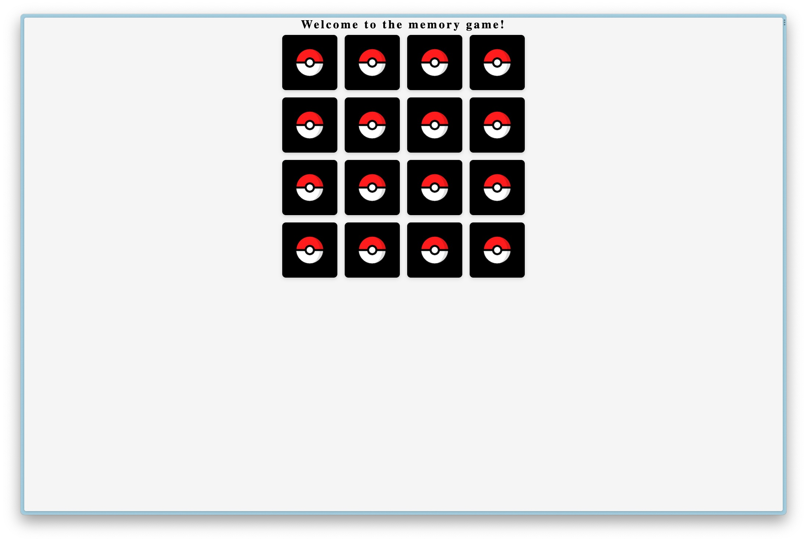
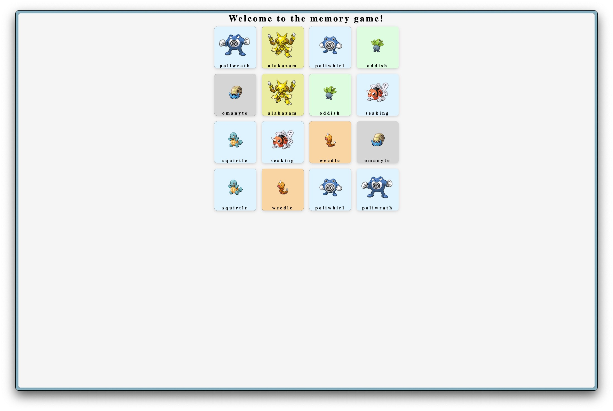

# MemoryGame

Jeu de mémoire avec les images Pokémon
Projet perso et en cours

## Le principe

Toutes les images sont faces cachées.
Un joueur retourne deux images. Si c'est la même image qui apparaît sur les deux images, le joueur gagne 1 point.
Si les deux images ne vont pas ensemble, le joueur ne gagne pas de point.
Pour gagner, il faut trouver toutes les paires

## Fonctionnement

-   Je fais appel à l'api pokeapi.co pour récupérer les informations des Pokémon.
-   Avec la data, je prends au hasard 8 éléments (les 8 Pokémon).
-   Je double ce tableau pour avoir 16 Pokémon.
-   Avant d'afficher les images, je fais un nouveau mélange de celle-c

Memory game with Pokémon images
Personal and current project

## The principle

All images are face down.
A player flips two images. If the same image appears on both images, the player earns 1 point.
If the two images do not match, the player does not earn a point.
To win, you have to find all the pairs

## Functioning

-   I use the pokeapi.co api to retrieve Pokémon information.
-   With the data, I randomly take 8 elements (the 8 Pokémon).
-   I double this table to have 16 Pokémon.
-   Before displaying the images, I make a new mix of it

